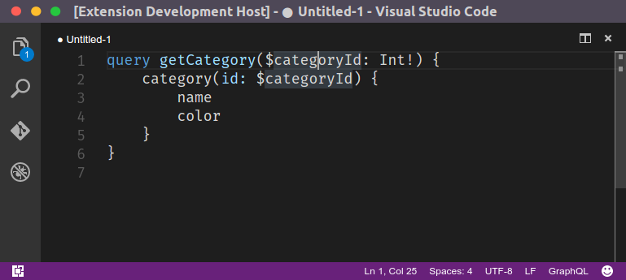

# GraphQL for VS Code

This package provide some syntax highlighting and snippeds for the GraphQL language. Files ending with `.gql` or `.graphql` will be automatically handled.

This is an early stage package, it doesn’t include the following desirable features:

* [ ] Symbols identification allowing refactoring tools to work corrently (eg. to rename a field)
* [ ] Better syntax highlighting that support variables, types, schemas, etc.
* [ ] Inline highlighting in JavaScript/Typescript code with the ES6 `graphql\`query { }\`` template string
* [ ] Client side autocompletion based on some server-side schema, similar to what Graph<em>i</em>ql is doing

And more :)

## License

MIT

## Developement

Clone this package and open-it in VS Code. Press <kbd>F5</kbd> to start a instance of VS Code running your modified extension.

> Note that the files syntaxes/graphql.json and snippets/graphql.json were originally derived from the [Atom package](https://atom.io/packages/language-graphql) released under the [MIT license](https://github.com/rmosolgo/language-graphql/tree/037e5d46ea7c5eeeac412192ab8a3cf72157be2d#license).
